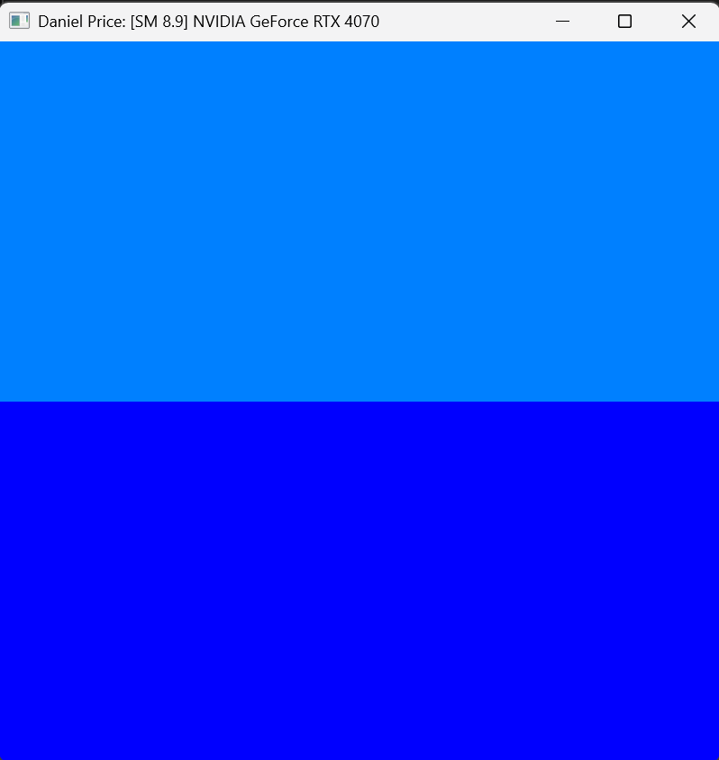
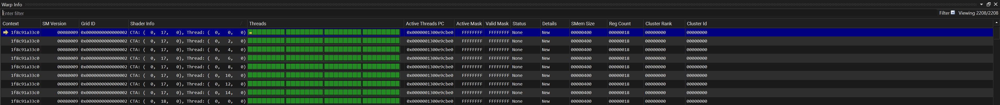
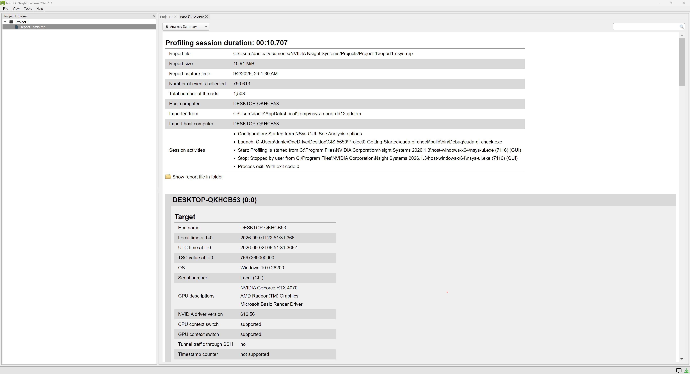
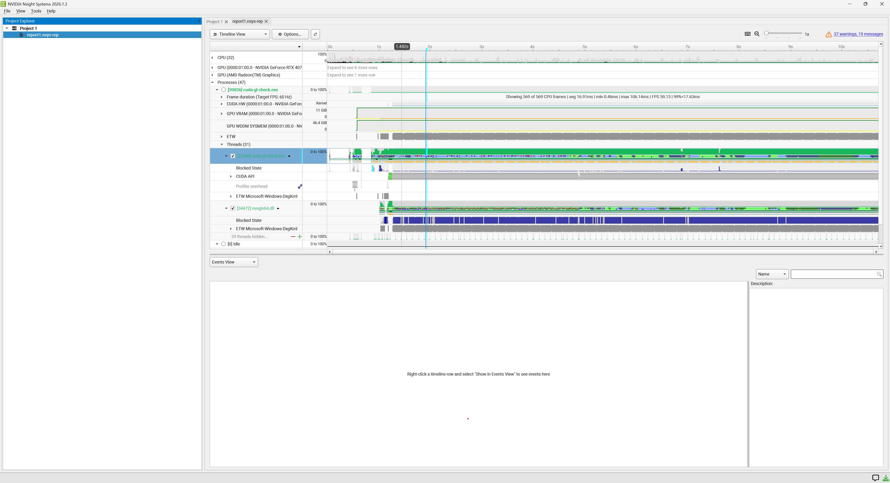
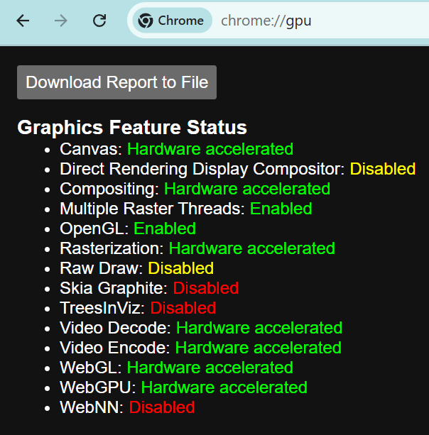
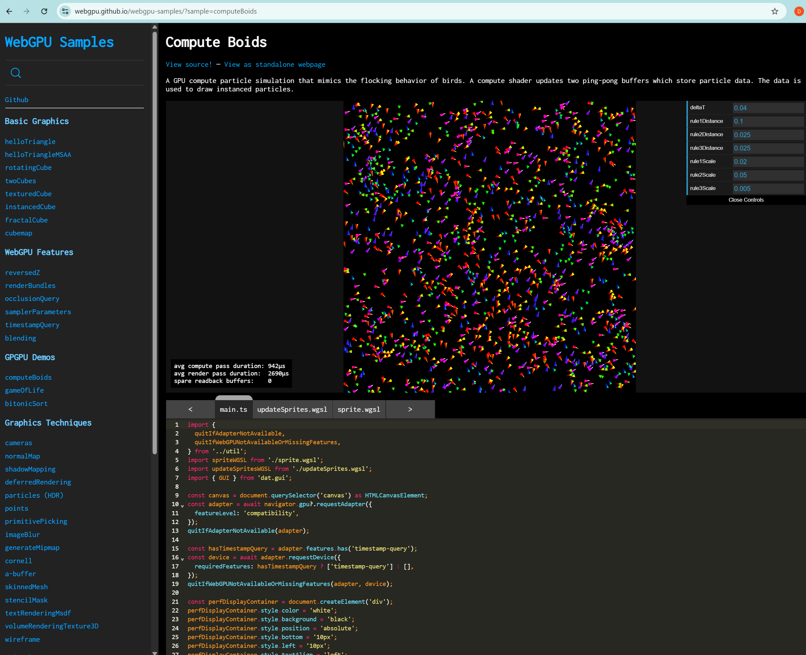

Project 0 Getting Started
====================

**University of Pennsylvania, CIS 5650: GPU Programming and Architecture, Project 0**

* Daniel Price
  * [LinkedIn](https://www.linkedin.com/in/daniel-d-price/)
* Tested on: Windows 11, AMD Ryzen 9 7950X @ 4.50GHz 64GB, NVIDIA GeForce RTX 4070 12.0GB

## CUDA GL Check

Compute Compatability: 8.9

### 2.1.2

### 2.1.3

### 2.1.4

### 2.2

### 2.3

